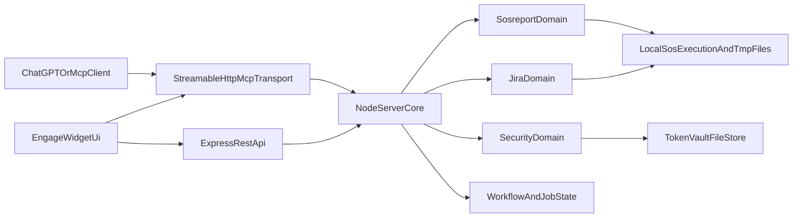
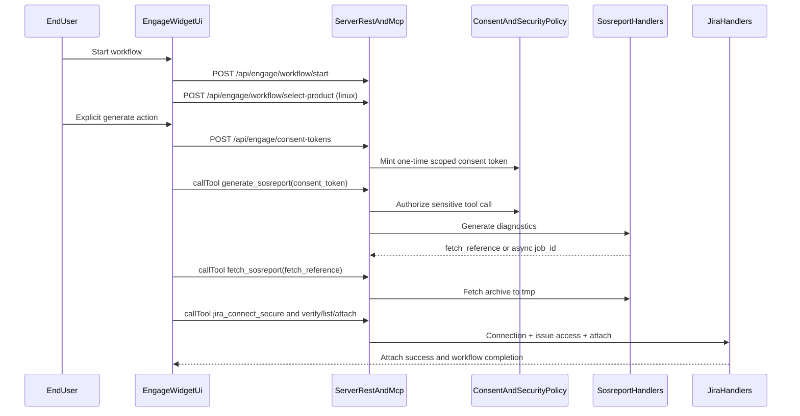
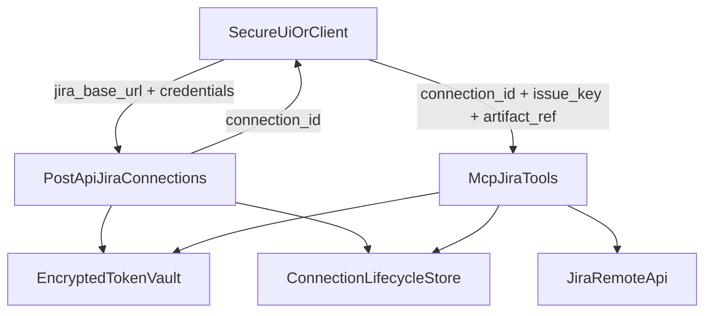

# GPT App POC Work Summary

**Last Updated:** 2026-03-31  
**Summary Commit Range:** `293b074` -> `2cbc362`  
**Summary Baseline Commit (HEAD analyzed):** `2cbc362`

## Scope and Framing

This summary covers the `gpt-app-poc` project from the first commit (`293b074`, 2026-01-30) through current `HEAD` (`2cbc362`, 2026-03-24).  
The narrative is intentionally split into:

1. **Specification intent** (`specs/001` through `specs/016`) to show iterative and incremental design intent.
2. **Implementation reality** (git history and tags) to show what was concretely delivered and when.

The result is a traceable view of intent-to-delivery progression.

## 1) Specification-Driven Delivery Intent (001-016)

The project followed a consistent specification package model (`spec.md`, `plan.md`, `tasks.md`) where each increment established explicit user stories, acceptance criteria, and non-goals before implementation.

### Per-Spec Intent Summary

| Spec | Theme | Intent (High Level) | Notable Intended Outcome |
|---|---|---|---|
| 001 | MCP Apps Hello World | Establish a minimal MCP Apps compliant baseline with UI resource and deterministic text fallback. | A single "hello world" path works in both UI-capable and text-only hosts. |
| 002 | MCP smoke tests | Add repeatable post-build validation for MCP behavior and app resource serving. | One command validates health, tool flow, and fallback output. |
| 003 | ChatGPT app readiness | Align with distribution requirements (HTTPS endpoints, widget metadata/CSP, privacy/support surfaces). | Dev/prod readiness posture for ChatGPT app submission constraints. |
| 004 | Jira attachment PAT | Introduce secure Jira connection and attachment workflow with backend-only secret handling. | PAT/API secrets never cross MCP tool boundary. |
| 005 | Skill discovery | Publish skill content as canonical MCP resource and add discovery mechanism. | Hosts can discover and read skill guidance predictably. |
| 006 | Local sosreport flow | Add local diagnostics generation and fetch flow with controlled privilege model. | `generate_sosreport` and `fetch_sosreport` integrate into support flow. |
| 007 | Engage support (initial) | Compose a practical support workflow using existing tools and UI/skill orchestration. | End-to-end support path from product selection to Jira attachment. |
| 008 | Endpoint switch | Normalize active environment defaults to current public endpoint. | Lower setup friction and reduce stale endpoint usage. |
| 009 | Get skill tool | Provide tool-based skill retrieval for hosts lacking resource-read capability. | Skill consumption parity across host capabilities. |
| 010 | Engage workflow structure | Split monolithic support journey into explicit gated steps. | Ordered step model: product -> diagnostics -> Jira attach. |
| 011 | Consent gate diagnostics | Enforce explicit human consent before diagnostics generation via server policy. | `generate_sosreport` denied without valid one-time consent. |
| 012 | PatternFly UI swap | Replatform UI to PatternFly without changing behavioral contracts. | Visual/UX modernization with functional parity. |
| 013 | MCP consent mint path | Add headless-compatible consent minting while preserving web consent path. | Text/headless clients can complete consented diagnostics flow. |
| 014 | Headless compatibility hardening | Formalize explicit permission and parsing compatibility for headless flows. | Structured-first with deterministic text fallback for compatibility. |
| 015 | Engage support split readiness | Document UI-first skill with placeholder path for future dedicated headless skill. | Clear split strategy without premature headless skill implementation. |
| 016 | Jira cloud auth | Add Jira Cloud email/API-token auth path while retaining prior compatibility path. | Connect/verify/list/attach works for Atlassian Cloud model. |

### Iterative and Incremental Phases (Intent View)

- **Phase A - Foundation (`001-003`)**: baseline MCP app behavior, automated confidence checks, and external readiness requirements.
- **Phase B - Secure capability expansion (`004-005`)**: secure Jira secret boundary and discoverable skill interfaces.
- **Phase C - Diagnostics and workflow integration (`006-007`)**: add local diagnostics and assemble initial engage-support experience.
- **Phase D - Operability and host compatibility (`008-009`)**: stabilize endpoint defaults and broaden host interoperability.
- **Phase E - Workflow safety and UX maturity (`010-012`)**: stepwise orchestration, explicit consent enforcement, and UI framework modernization.
- **Phase F - Headless compatibility and cloud auth (`013-016`)**: strengthen headless path semantics and complete Jira Cloud credential support.

## 2) Implementation Timeline from Git History

### Release and Scope Markers

- **Initial commit**: `293b074` (2026-01-30) - project scaffold.
- **Tag `0.1.0`**: points at `c7df45d` (2026-03-10), annotated as self-hosted Jira variant with PatternFly UI + text fallback.
- **Current HEAD**: `2cbc362` (2026-03-24), post `016-jira-cloud-auth` workflow updates.

### Chronological Delivery Milestones (Implementation View)

- **2026-01-30** - Scaffold initialized (`293b074`).
- **2026-02-02** - Spec-driven MCP baseline implementation landed (`a5ca4a9` through `1990735`), including schema validation correction.
- **2026-02-03** - Smoke tests (`002`) and technical readiness (`003`) implemented with privacy/support verification (`c73fdc2` through `ff0ab87`).
- **2026-02-04** - License formalization and debug instrumentation (`01ba455`, `95d6273`).
- **2026-02-11 to 2026-02-12** - Jira PAT/attachment feature train (`004`) with serving and SSE follow-up fixes (`c78f309` through `1aa80c6`).
- **2026-02-13 to 2026-02-16** - Skill discovery (`005`) completed (`37ecd8f` through `f57ab19`).
- **2026-02-18** - High-throughput integration day: local sosreport (`006`), engage support (`007`), endpoint switch (`008`), get-skill (`009`) (`38ec8a3` through `2e44da4`).
- **2026-02-19 to 2026-02-27** - Hardening passes for PAT handling, log leakage, workflow constraints, consent gating (`010-011`), async generate progress (`ff12223` through `3c48387`).
- **2026-03-03** - PatternFly UI swap (`012`) and MCP consent mint path (`013`) delivered (`a29606c` through `f67991c`).
- **2026-03-05 to 2026-03-06** - Headless consent compatibility (`014`) and engage support split readiness (`015`) delivered (`675f3b6` through `c03d839`).
- **2026-03-10** - Backoff/resource alternatives and Jira default base updates around tag `0.1.0` (`25b2a45`, `c7df45d`).
- **2026-03-24** - Jira Cloud auth package (`016`) completed with post-implementation workflow updates (`f7e799b` through `2cbc362`).

### Intent-to-Implementation Trace Pattern

Each major feature generally follows this practical pattern in history:

1. `specify` -> 2) `plan` -> 3) `tasks` -> 4) `implement` -> 5) targeted fix/hardening follow-ups.

This pattern appears repeatedly from `001` through `016`, supporting an intentionally incremental delivery cadence rather than one-shot feature drops.

## 3) Project Evolution at a Glance

The project evolved from a minimal MCP Apps proof-of-concept into a multi-surface support workflow platform with explicit security boundaries, deterministic compatibility outputs, and layered quality checks.  
The strongest throughline is **governed iteration**: specification packages define intent, implementation commits realize intent in small units, and hardening commits close safety/operability gaps before the next increment.

## 4) High-Level Architecture (Today)

Current architecture centers on a single Node/TypeScript service that exposes both MCP and REST interfaces, plus a single-file React/PatternFly widget.

- **Core runtime**: `server.ts` composes MCP tool/resource registration and REST routes.
- **Domain modules**: `src/jira/`, `src/sosreport/`, `src/security/`, and `src/mcp-app/`.
- **Security boundary**: credential intake via REST backend endpoints only; MCP calls use opaque IDs and constrained payloads.
- **State model**: file-backed vault + in-memory workflow/job maps.
- **Testing model**: smoke + unit + contract + integration + regression scripts.

### Mermaid: System Context and Component Boundaries

### Mermaid: Engage Support Workflow Sequence

### Mermaid: Jira Secret Boundary Data Flow

## 5) Areas of Specialization Covered

- **MCP Apps integration and host compatibility**: app resources, tool annotations, deterministic fallback content, resource/tool dual pathways.
- **Security architecture**: backend-only secret intake, encrypted vault storage, token lifecycle controls, consent token mint/validation, log redaction.
- **Workflow orchestration**: server-enforced step gates and asynchronous sosreport job lifecycle.
- **Jira integration engineering**: attachment flows, connection verification, lifecycle status handling, and cloud-auth transition.
- **Diagnostics tooling integration**: controlled local `sos report` execution and archive handoff pipeline.
- **UI engineering and migration discipline**: PatternFly swap preserving behavior and contracts.
- **Specification-driven delivery practice**: repeatable spec-plan-tasks-implement cadence across 16 increments.
- **Quality and regression strategy**: smoke, unit, contract, integration, and security-focused regression coverage.

## 6) Current State and Next Logical Frontier

### Current State

- Functioning support workflow from product selection through diagnostics and Jira attachment.
- Both UI-first and headless-compatible consent pathways exist for diagnostics operations.
- Jira Cloud auth support is implemented while preserving compatibility routes.
- Security posture explicitly codified in docs and reinforced in implementation patterns.

### Next Logical Frontier (High-Level)

- Formalize deployment pipeline-as-code (CI/CD workflow definitions) for repeatable environment promotion.
- Expand observability beyond structured security events into richer service telemetry.
- Continue headless/UI split maturation into explicit, versioned skill surfaces where needed.
- Maintain spec-first discipline while tightening explicit traceability artifacts between spec acceptance criteria and regression suites.

## SVG Assets

- [Development phases timeline](diagrams/development-phases.svg)
- [Architecture boundaries map](diagrams/architecture-boundaries.svg)

These SVGs are intended for slide decks and documents where static vector visuals are preferable to embedded Mermaid rendering.
